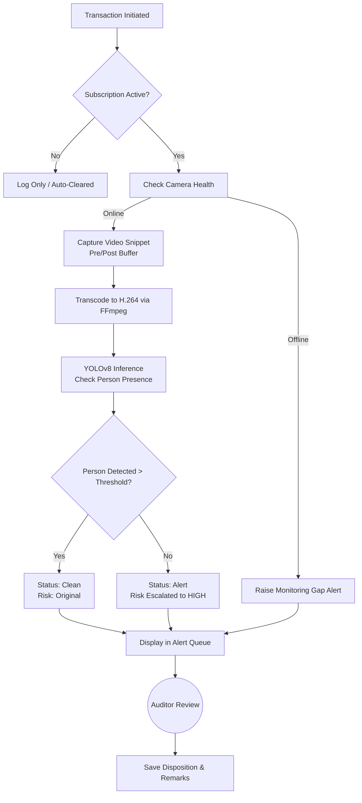

# SmartCare RBATPM

**SmartCare Risk-Based Action Tracking & Proactive Monitoring (RBATPM)** is an advanced, AI-powered surveillance and auditing platform designed for enterprise and healthcare environments. It correlates point-of-sale (POS) and administrative transactions with real-time CCTV camera feeds, using Computer Vision to detect anomalies—such as an employee performing a transaction at an empty counter—and raising alerts for auditor review.

---

## 📖 Table of Contents
1. [Application Overview](#application-overview)
2. [Workflow & Flowchart](#workflow--flowchart)
3. [Tech Stack & Significance](#tech-stack--significance)
4. [Project Structure & Files](#project-structure--files)
5. [Orchestration (`run.sh`)](#orchestration-runsh)
6. [Architecture Details](#architecture-details)

---

## 🌟 Application Overview

The SmartCare RBATPM platform bridges the gap between transactional data (like billing, refunds, and pharmacy dispensing) and physical reality. 

When a transaction is initiated, the system evaluates its risk based on customizable rules (e.g., high transaction amount, specific action types like "Cash Refund"). If the transaction requires video verification (Counter Subscription is Active), the backend captures a video snippet of the transaction from the corresponding camera (including a configurable pre-buffer and post-buffer).

The captured video is then processed using **YOLOv8** to verify human presence at the counter. If the system detects that the counter was empty during the transaction, it escalates the risk to **HIGH** and raises an alert. Auditors can then use the intuitive Web Dashboard to review the evidence (both recorded video and live WebRTC streams), verify the detection, and disposition the alert.

---

## 🔄 Workflow & Flowchart

### Core Workflow
1. **Transaction Simulation**: A transaction is triggered via the API (or the UI Simulator).
2. **Risk Assessment**: The backend evaluates the transaction's inherent risk based on amount and action type.
3. **Video Capture**: The system fetches the RTSP stream for the specific counter, recording a snippet containing pre- and post-buffer frames.
4. **AI Inference**: The recorded clip is processed by YOLOv8. The model checks for human presence, optionally constrained by dynamically configured Regions of Interest (ROI).
5. **Transcoding**: The raw video is transcoded to H.264 using FFmpeg to ensure seamless playback in web browsers.
6. **Alert Generation**: If the person presence ratio falls below a defined threshold, an alert is triggered.
7. **Auditor Review**: The alert appears on the dashboard. An auditor watches the video, checks the live camera health, adds remarks, and closes the case (Verified Clean, Verified Discrepancy, or Escalated).

### Flowchart (Mermaid)

---

## 🛠 Tech Stack & Significance

### Backend
*   **FastAPI (Python)**: Provides a high-performance, asynchronous REST API. It handles transaction ingestions, background video processing, and UI data polling with extremely low overhead.
*   **YOLOv8 (Ultralytics)**: State-of-the-art, real-time object detection model. It runs on the GPU (CUDA) to accurately detect humans in video frames, powering the core anomaly detection logic.
*   **OpenCV (`cv2`)**: Used for real-time RTSP stream consumption, frame buffering, and drawing dynamic ROIs.
*   **SQLite**: A lightweight, file-based relational database. It requires no external server setup, making the application highly portable while still providing ACID compliance for audit trails and alert tracking.

### Video Infrastructure
*   **MediaMTX**: A versatile, zero-dependency RTSP/WebRTC server. It translates heavy RTSP feeds from IP cameras into ultra-low-latency WebRTC streams that can be embedded directly into the browser without plugins.
*   **FFmpeg**: The industry-standard multimedia framework. It is used to proxy RTSP streams to MediaMTX and to transcode recorded MP4 snippets into the highly compatible H.264 format for HTML5 `<video>` tags.

### Frontend
*   **Vanilla HTML / CSS / JS**: The dashboard is built without heavy frontend frameworks (like React or Angular) to maximize performance and ensure a small footprint. 
*   **Glassmorphism UI**: Uses modern, translucent CSS styling (`backdrop-filter`) to create a premium, futuristic, and highly responsive user experience. 

---

## 📂 Project Structure & Files

*   **`main.py`**: The core Python backend. Contains the FastAPI application, SQLite database interactions, YOLO inference logic, and the `RecorderManager` for camera buffering.
*   **`run.sh`**: The master orchestration bash script. (See detailed explanation below).
*   **`config.ini`**: The master configuration file. Centralizes all system variables including camera URLs, YOLO model parameters, risk thresholds, and directory paths.
*   **`templates/index.html`**: The monolithic frontend file containing all HTML structure, CSS styling, and JavaScript logic for the dashboard, analytics, and ROI configuration.
*   **`mediamtx.yml`**: Configuration file for the MediaMTX WebRTC server, mapping internal RTSP proxy paths.
*   **`rbatpm.db`**: The SQLite database file (auto-generated) storing counters, alerts, ROI configurations, and audit logs.
*   **`yolo26l.pt`**: The compiled YOLOv8 model weights file.
*   **`clips/`**: Directory where processed MP4 evidence videos are stored.

---

## 🚀 Orchestration (`run.sh`)

The `run.sh` script acts as the master orchestrator for the entire platform. Its workflow ensures that all infrastructure dependencies are met before the backend starts:

1.  **System Checks**: Validates the presence of Python 3, `config.ini`, the Docker daemon (for MediaMTX), and CUDA GPU availability.
2.  **Configuration Parsing**: Dynamically reads `config.ini` using Python to extract IP addresses, ports, and camera URLs.
3.  **Video Infrastructure Spawning**:
    *   Cleans up any dangling Docker containers or FFmpeg processes from previous runs.
    *   Spawns a **MediaMTX Docker Container** in the background, bound to the host network.
    *   Iterates through all configured cameras and spawns background **FFmpeg proxy processes** to feed the raw RTSP streams into MediaMTX.
4.  **Backend Launch**: Finally, starts the FastAPI server (`python3 main.py`) and outputs the dashboard URL.

---

## 🏗 Architecture Details

### Frontend Architecture
The frontend is a Single Page Application (SPA) designed with a tabbed interface (Dashboard, Analytics, ROI Settings). It uses a polling mechanism (`fetchSystemData`) every 5 seconds to retrieve the latest alerts and counter data from the backend APIs. By hashing the JSON payloads, it avoids unnecessary DOM repaints, ensuring a buttery-smooth UI even when processing heavy data.

### Backend Architecture
The backend is driven by FastAPI events. On startup, it initializes the `RecorderManager`, which spawns a dedicated background thread for every configured camera. These threads continuously consume RTSP frames using OpenCV and maintain a rolling "ring buffer" of frames in memory. 

When a transaction occurs, the backend slices the required pre-buffer and post-buffer frames from this ring memory and saves them to disk. A background task (`process_clip_background`) is then triggered to transcode the video and run the YOLO model across the frames.

### Database Architecture
The SQLite database consists of three primary tables:
1.  **`counters`**: Maps physical locations (e.g., "Pharmacy Counter 1") to specific Camera IDs, tracking subscription status and camera health.
2.  **`alerts`**: The master ledger. Records every transaction, its risk score, paths to recorded video clips, YOLO detection results, and the full timeline of auditor remarks and status changes.
3.  **`roi_configs`**: Stores the coordinate polygons for dynamically drawn Regions of Interest, ensuring YOLO inference is restricted to specific zones within a camera's field of view.

---

## 📋 Mapping to Functional Requirements

The SmartCare RBATPM implementation successfully fulfills all constraints and workflows outlined in the **RBATPM Functional Requirements** document. Here is exactly how the requested features are implemented and displayed:

### 1. Subscription & Risk Evaluation (Phase 1)
*   **Requirement:** Evaluate risk and check the `Subscription (Y/N)` flag for monitored counters.
*   **Implementation:** The FastAPI backend intercepts incoming transactions, computes the risk score, and queries the `counters` SQLite table to check if the specific location has an active subscription. Unsubscribed transactions are bypassed instantly, maintaining high system throughput.

### 2. Video Capture & Pre/Post Buffers (Phase 2)
*   **Requirement:** Trigger the VAS (Video Analytics System) to capture video with specific Pre-buffer and Post-buffer durations. Identify "Monitoring Gaps" if a camera is offline.
*   **Implementation:** Rather than integrating an external VAS, this platform *acts* as the VAS. The backend `RecorderManager` spawns OpenCV threads that maintain a continuous ring-buffer of frames in memory. When triggered, it perfectly slices the configured pre/post buffers. If the RTSP stream is unreachable, it logs a `Camera Health Status` of Offline and immediately raises a **Monitoring Gap** alert.

### 3. The CCTV Alert Dashboard (Phase 3 & 4)
*   **Requirement:** A dashboard for reviewers to see the Alert Queue, view live streams, watch recordings, cross-reference logs, add narratives, and disposition alerts (Verified-Clean, Verified-Discrepancy, Escalated).
*   **Implementation:** The monolithic `templates/index.html` Single Page Application serves as the unified dashboard.
    *   **Live Stream:** Implemented using **MediaMTX** to convert RTSP to WebRTC, providing zero-latency live feeds directly in the browser.
    *   **Recordings:** The raw buffer frames are transcoded by background **FFmpeg** processes into H.264 MP4 clips (assigned a `Clip ID`) and embedded directly in the Alert Detail View.
    *   **Review & Disposition:** Reviewers can click any alert in the queue to open the detailed modal, add a timestamped narrative, and use the UI buttons to mark the transaction as Clean, Discrepancy, or Escalated. This updates the `alerts` table in the database in real-time.

### 4. Value-Add: YOLOv8 AI Verification
*   **Enhancement:** The original requirements treated the VAS as a black box. Our implementation natively integrates **YOLOv8** to proactively scan the captured buffer for human presence within drawn Regions of Interest (ROI). This automatically filters out false positives, ensuring that auditors only spend time reviewing transactions where the counter was actually empty.
