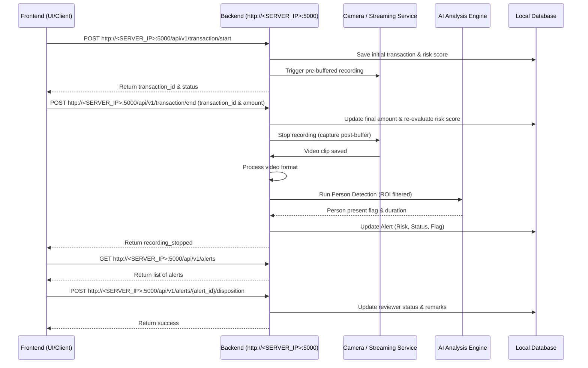

# SmartCare RBATPM - Backend API Integration Guide

This document provides a comprehensive guide for frontend clients integrating with the SmartCare Risk-Based Action Tracking & Proactive Monitoring (RBATPM) backend. It covers system workflow, base URL setup, full API endpoints with server domain/IP placeholders, request/response formats, and integration details.

---

## 🌐 Server Base URL & Environment Setup

All backend REST API endpoints are hosted on the RBATPM edge server / cloud instance. 

* **Base URL Pattern:** `http://<SERVER_IP>:<PORT>` or `http://<YOUR_DOMAIN_NAME>:<PORT>`
* **Default Server Port:** `5000` (Configurable in `config.ini` under `[server] port = 5000`)
* **Local Development Base URL:** `http://localhost:5000`
* **Example Network Deployment Base URL:** `http://192.168.0.142:5000`
* **Example Domain Base URL:** `http://yourdomainname:5000`

> 💡 **Note for Client Integrators:** Replace `<SERVER_IP>` or `<YOUR_DOMAIN_NAME>` in all endpoints below with your actual server IP address (e.g., `192.168.0.142` or `localhost`) or domain name.

---

## 🔄 System Architecture & Flowchart



---

## 📋 Complete API Endpoints Summary

Below is the complete list of all **17 API endpoints** formatted with full Base URL structures (`http://<SERVER_IP>:5000/...` or `http://<YOUR_DOMAIN_NAME>:5000/...`):

### 1. Transaction Management APIs
| Method | Full Endpoint URL | Description |
|---|---|---|
| `POST` | `http://<SERVER_IP>:5000/api/v1/transaction/start` | Initiates a transaction & starts pre-buffered camera recording |
| `POST` | `http://<SERVER_IP>:5000/api/v1/transaction/end` | Stops transaction recording & triggers YOLO AI analysis |
| `POST` | `http://<SERVER_IP>:5000/api/v1/transaction` | *(Legacy)* Starts transaction and auto-stops after 3s |

### 2. Analytics & Auditing APIs
| Method | Full Endpoint URL | Description |
|---|---|---|
| `GET` | `http://<SERVER_IP>:5000/api/v1/alerts` | Fetches all alert logs, transactions, and monitoring gaps |
| `POST` | `http://<SERVER_IP>:5000/api/v1/alerts/{alert_id}/disposition` | Submits auditor verdict and narrative remarks for an alert |
| `GET` | `http://<SERVER_IP>:5000/api/v1/counters` | Lists registered counters, camera mappings, and health status |
| `POST` | `http://<SERVER_IP>:5000/api/v1/counters/{counter_id}/subscription` | Enables/disables video recording subscription for a counter |

### 3. Video Streaming & Verification APIs
| Method | Full Endpoint URL | Description |
|---|---|---|
| `GET` | `http://<SERVER_IP>:5000/api/v1/webrtc-url?camera_id=CAM01` | Returns low-latency WebRTC stream URL for live viewing |
| `GET` | `http://<SERVER_IP>:5000/api/v1/stream-url?camera_id=CAM01` | Returns internal camera stream source configuration |
| `GET` | `http://<SERVER_IP>:5000/api/v1/live-stream?camera_id=CAM01` | Provides direct MJPEG live video feed for standard `` tags |
| `GET` | `http://<SERVER_IP>:5000/api/v1/latest-frame.jpg?camera_id=CAM01` | Captures single latest JPEG snapshot from camera |
| `GET` | `http://<SERVER_IP>:5000/api/v1/roi-frame/{camera_id}` | Captures clean full-resolution snapshot for ROI canvas background |

### 4. Region of Interest (ROI) Configuration APIs
| Method | Full Endpoint URL | Description |
|---|---|---|
| `GET` | `http://<SERVER_IP>:5000/api/v1/roi/{camera_id}` | Retrieves active ROI polygon coordinates for a camera |
| `POST` | `http://<SERVER_IP>:5000/api/v1/roi/{camera_id}` | Saves / overwrites ROI polygon configurations for a camera |
| `DELETE` | `http://<SERVER_IP>:5000/api/v1/roi/{camera_id}/{roi_name}` | Deletes a specific ROI polygon zone by name |

### 5. System & Legacy APIs
| Method | Full Endpoint URL | Description |
|---|---|---|
| `GET` | `http://<SERVER_IP>:5000/` | Serves the web dashboard UI interface |
| `POST` | `http://<SERVER_IP>:5000/upload-images` | *(Legacy)* Image upload endpoint for synchronous YOLO inference |

---

## 🛠 Detailed API Endpoint Specifications

### 1. Transaction Management

#### 🟢 Start Transaction
* **Endpoint:** `POST http://<SERVER_IP>:5000/api/v1/transaction/start`
* **Significance:** Initiates a new transaction on a counter. Calculates initial risk based on transaction action type and triggers the camera stream manager to begin recording video with pre-buffer.
* **Request Headers:** `Content-Type: application/json`
* **Payload Example:**
```json
{
  "staff_id": "STF102",
  "counter_id": "Billing Desk 1",
  "module": "Billing",
  "action_type": "Refund",
  "subscription": "Y",
  "pre_buffer_sec": 5,
  "post_buffer_sec": 5
}
```
* **Returns:** 
```json
{
  "status": "recording_started",
  "transaction_id": "TXN_ABC123",
  "clip_id": "clip_8f3a12b4"
}
```

#### 🔴 End Transaction
* **Endpoint:** `POST http://<SERVER_IP>:5000/api/v1/transaction/end`
* **Significance:** Signals the conclusion of an active transaction. Receives final transaction amount, re-evaluates rule risk score, commands the recording engine to capture post-buffer frames, finalize video clip, and run AI analysis.
* **Request Headers:** `Content-Type: application/json`
* **Payload Example:**
```json
{
  "transaction_id": "TXN_ABC123",
  "amount": 6500.0
}
```
* **Returns:** 
```json
{
  "status": "recording_stopped",
  "transaction_id": "TXN_ABC123"
}
```

#### 🟡 Trigger Transaction (Legacy Wrapper)
* **Endpoint:** `POST http://<SERVER_IP>:5000/api/v1/transaction`
* **Significance:** Legacy wrapper for `/transaction/start` that automatically ends the transaction after 3 seconds. Use only for specific backwards compatibility.

---

### 2. Analytics & Auditing

#### 📊 Get All Alerts
* **Endpoint:** `GET http://<SERVER_IP>:5000/api/v1/alerts`
* **Significance:** Fetches all alerts, transactions, and monitoring gaps from the database. Used to populate the frontend Analytics and Audit dashboard.
* **Returns:** Array of alert objects.
```json
[
  {
    "id": 1,
    "transaction_id": "TXN_ABC123",
    "staff_id": "STF102",
    "counter_id": "Billing Desk 1",
    "module": "Billing",
    "action_type": "Refund",
    "amount": 6500.0,
    "timestamp": "2026-08-03T12:00:00",
    "risk_score": "High",
    "clip_id": "clip_8f3a12b4",
    "clip_url": "/clips/clip_8f3a12b4.mp4",
    "recording_status": "Ready",
    "camera_health": "Online",
    "person_present": 0,
    "person_count": 0,
    "presence_duration_sec": 0.0,
    "clip_duration_sec": 10.0,
    "flag": "alert",
    "reviewer_status": "Pending",
    "reviewer_remarks": null,
    "reviewer_time": null,
    "audit_logs": "[{\"time\":\"12:00:00\",\"msg\":\"Transaction initiated\"}]"
  }
]
```

#### ✍️ Save Auditor Disposition
* **Endpoint:** `POST http://<SERVER_IP>:5000/api/v1/alerts/{alert_id}/disposition`
* **Significance:** Used by human auditors in the dashboard to review an alert and save their final verdict (Verified-Clean, Verified-Discrepancy, Escalated) and remarks.
* **URL Example:** `http://<SERVER_IP>:5000/api/v1/alerts/1/disposition`
* **Payload Example:**
```json
{
  "remarks": "Reviewed CCTV. Counter was vacant during cash refund.",
  "outcome": "Verified-Discrepancy"
}
```
* **Returns:** `{"status": "success"}`

#### 🖥️ Get Registered Counters
* **Endpoint:** `GET http://<SERVER_IP>:5000/api/v1/counters`
* **Significance:** Fetches the list of all registered counters, mapping them to camera IDs and reporting their current Health Status (Online/Offline).

#### 🔘 Toggle Counter Subscription
* **Endpoint:** `POST http://<SERVER_IP>:5000/api/v1/counters/{counter_id}/subscription`
* **URL Example:** `http://<SERVER_IP>:5000/api/v1/counters/Billing%20Desk%201/subscription`
* **Payload Example:**
```json
{
  "active": true
}
```
* **Returns:** `{"status": "success"}`

---

### 3. Video Streaming & Verification

#### 🎥 Get WebRTC Stream URL
* **Endpoint:** `GET http://<SERVER_IP>:5000/api/v1/webrtc-url?camera_id=CAM01`
* **Significance:** Fetches the low-latency live stream endpoint URL. Used by the frontend to embed live streams during investigations with minimal delay.

#### 📹 Get Stream URL
* **Endpoint:** `GET http://<SERVER_IP>:5000/api/v1/stream-url?camera_id=CAM01`
* **Significance:** Returns the raw internal video source URL for a camera.

#### 📺 Live MJPEG Stream Feed
* **Endpoint:** `GET http://<SERVER_IP>:5000/api/v1/live-stream?camera_id=CAM01`
* **Significance:** Provides a direct live video feed for real-time CCTV monitoring directly in the browser using a standard `` tag without advanced streaming overhead.

#### 🖼️ Get Latest Frame
* **Endpoint:** `GET http://<SERVER_IP>:5000/api/v1/latest-frame.jpg?camera_id=CAM01`
* **Significance:** Returns a single high-quality snapshot representing the most recent frame captured by the camera.

#### 📐 Get ROI Reference Frame
* **Endpoint:** `GET http://<SERVER_IP>:5000/api/v1/roi-frame/{camera_id}`
* **URL Example:** `http://<SERVER_IP>:5000/api/v1/roi-frame/CAM01`
* **Significance:** Returns a clean snapshot of the camera without time/date overlays, strictly for use as a background when drawing ROI polygons in the configuration canvas.

---

### 4. Region of Interest (ROI) Configuration

#### 🔍 Get ROI Configuration
* **Endpoint:** `GET http://<SERVER_IP>:5000/api/v1/roi/{camera_id}`
* **URL Example:** `http://<SERVER_IP>:5000/api/v1/roi/CAM01`
* **Significance:** Fetches the saved Region of Interest polygons (coordinates) for a specific camera.

#### 💾 Save ROI Configuration
* **Endpoint:** `POST http://<SERVER_IP>:5000/api/v1/roi/{camera_id}`
* **URL Example:** `http://<SERVER_IP>:5000/api/v1/roi/CAM01`
* **Payload Example:**
```json
{
  "rois": [
    {
      "name": "Counter Zone 1",
      "coords": [100, 200, 400, 200, 400, 500, 100, 500]
    }
  ],
  "config_width": 1280,
  "config_height": 720
}
```
* **Returns:** `{"status": "success", "count": 1}`

#### 🗑️ Delete Specific ROI Polygon
* **Endpoint:** `DELETE http://<SERVER_IP>:5000/api/v1/roi/{camera_id}/{roi_name}`
* **URL Example:** `http://<SERVER_IP>:5000/api/v1/roi/CAM01/Counter%20Zone%201`
* **Significance:** Deletes a specific ROI polygon by name from a camera's configuration.

---

### 5. System & Legacy

#### 🌐 Web Interface
* **Endpoint:** `GET http://<SERVER_IP>:5000/`
* **Significance:** Serves the frontend UI from the backend natively.

#### 📤 Upload Image Inference (Legacy)
* **Endpoint:** `POST http://<SERVER_IP>:5000/upload-images`
* **Significance:** A legacy endpoint accepting image upload for synchronous YOLO prediction.
