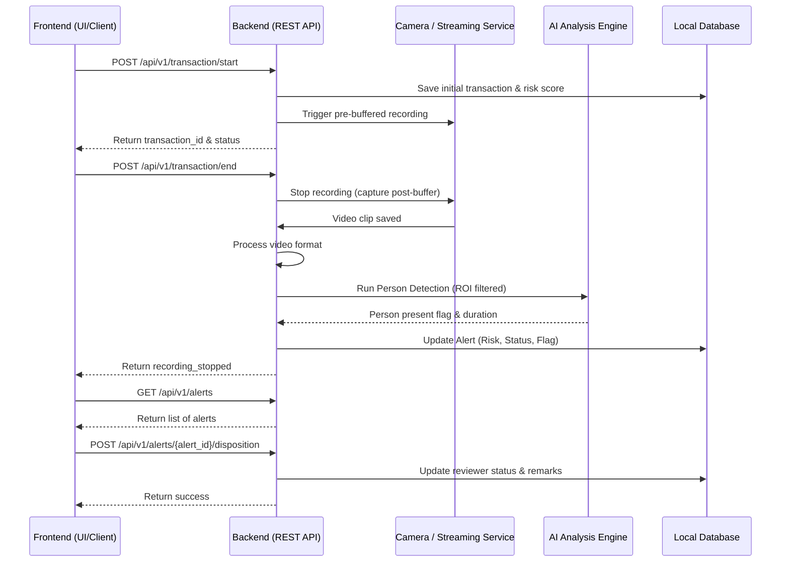

# SmartCare RBATPM - Backend API Integration Guide

This document provides a comprehensive guide for frontend clients integrating with the SmartCare Risk-Based Action Tracking & Proactive Monitoring (RBATPM) backend. It covers the system workflow, the list of available APIs, and their operational significance.

## System Architecture & Flowchart

The RBATPM backend provides a robust REST API running continuously on the edge appliance. It manages live video feeds, tracks ongoing transactions, records video snippets, runs AI video analysis, and manages alerts and ROI (Region of Interest) configurations.



---

## API Summary Overview

The backend exposes a total of **17 API endpoints**. 

**Core Transaction APIs:**
1. `POST /api/v1/transaction/start`
2. `POST /api/v1/transaction/end`
3. `POST /api/v1/transaction` *(Legacy)*

**Analytics & Auditing APIs:**
4. `GET /api/v1/alerts`
5. `POST /api/v1/alerts/{alert_id}/disposition`
6. `GET /api/v1/counters`
7. `POST /api/v1/counters/{counter_id}/subscription`

**Video Streaming APIs:**
8. `GET /api/v1/stream-url`
9. `GET /api/v1/webrtc-url`
10. `GET /api/v1/live-stream`
11. `GET /api/v1/latest-frame.jpg`
12. `GET /api/v1/roi-frame/{camera_id}`

**Configuration (ROI) APIs:**
13. `GET /api/v1/roi/{camera_id}`
14. `POST /api/v1/roi/{camera_id}`
15. `DELETE /api/v1/roi/{camera_id}/{roi_name}`

**System & Legacy APIs:**
16. `GET /` *(UI)*
17. `POST /upload-images` *(Legacy)*

---

## Detailed API Documentation

### 1. Transaction Management

#### `POST /api/v1/transaction/start`
**Significance:** Initiates a new transaction on a counter. Calculates initial risk based on transaction amount/type and triggers the camera stream manager to begin recording video with pre-buffer.
**Payload:**
```json
{
  "staff_id": "STF102",
  "counter_id": "Billing Desk 1",
  "module": "Billing",
  "action_type": "Refund",
  "amount": 6500.0,
  "subscription": "Y",
  "pre_buffer_sec": 5,
  "post_buffer_sec": 5
}
```
**Returns:** `{"status": "recording_started", "transaction_id": "TXN_ABC123", "clip_id": "clip_..."}`

#### `POST /api/v1/transaction/end`
**Significance:** Signals the conclusion of an active transaction. Commands the recording engine to capture the post-buffer, finalize the video clip, process it for web compatibility, and run the AI analysis engine on the clip.
**Payload:**
```json
{
  "transaction_id": "TXN_ABC123"
}
```
**Returns:** `{"status": "recording_stopped", "transaction_id": "TXN_ABC123"}`

#### `POST /api/v1/transaction` (Legacy)
**Significance:** A legacy wrapper for `/transaction/start` that automatically ends the transaction after 3 seconds. Use only for specific backwards compatibility.

---

### 2. Analytics & Auditing

#### `GET /api/v1/alerts`
**Significance:** Fetches all alerts, transactions, and monitoring gaps from the database. Used to populate the frontend Analytics and Audit dashboard.
**Returns:** List of alert objects.

#### `POST /api/v1/alerts/{alert_id}/disposition`
**Significance:** Used by human auditors in the dashboard to review an alert and save their final verdict (Verified Clean, Escalated, etc.) and remarks.
**Payload:**
```json
{
  "remarks": "Reviewed CCTV. Customer was present.",
  "outcome": "Verified-Clean"
}
```

#### `GET /api/v1/counters`
**Significance:** Fetches the list of all registered counters, mapping them to camera IDs and reporting their current Health Status (Online/Offline).

#### `POST /api/v1/counters/{counter_id}/subscription`
**Significance:** Toggles whether video recording is active (Subscribed) for a given counter.
**Payload:**
```json
{
  "active": true
}
```

---

### 3. Video Streaming & Verification

#### `GET /api/v1/webrtc-url`
**Significance:** Fetches the low-latency live stream endpoint URL. This is used by the frontend to embed live streams during investigations with minimal delay.
**Query Parameter:** `?camera_id=CAM01`

#### `GET /api/v1/stream-url`
**Significance:** Returns the raw internal video source URL for a camera.

#### `GET /api/v1/live-stream`
**Significance:** Provides a direct live video feed for real-time CCTV monitoring directly in the browser using a standard `` tag without advanced streaming overhead.
**Query Parameter:** `?camera_id=CAM01`

#### `GET /api/v1/latest-frame.jpg`
**Significance:** Returns a single high-quality snapshot representing the most recent frame captured by the camera.

#### `GET /api/v1/roi-frame/{camera_id}`
**Significance:** Returns a clean snapshot of the camera without time/date overlays, strictly for use as a background when drawing ROI polygons in the configuration canvas.

---

### 4. Region of Interest (ROI) Configuration

#### `GET /api/v1/roi/{camera_id}`
**Significance:** Fetches the saved Region of Interest polygons (coordinates) for a specific camera. These ROIs constrain where the AI engine will look for person presence.

#### `POST /api/v1/roi/{camera_id}`
**Significance:** Saves/overwrites the ROI configurations for a specific camera.
**Payload:**
```json
{
  "rois": [
    {
      "name": "Counter Zone 1",
      "coords": [100, 200, 400, 200, 400, 500, 100, 500]
    }
  ],
  "config_width": 1280,
  "config_height": 720
}
```

#### `DELETE /api/v1/roi/{camera_id}/{roi_name}`
**Significance:** Deletes a specific ROI polygon by name from a camera's configuration.

---

### 5. System & Legacy

#### `GET /`
**Significance:** Serves the frontend UI from the backend natively.

#### `POST /upload-images`
**Significance:** A legacy endpoint from older pipeline iterations that accepts an image upload, runs AI inference synchronously, and returns the highest confidence detection.
