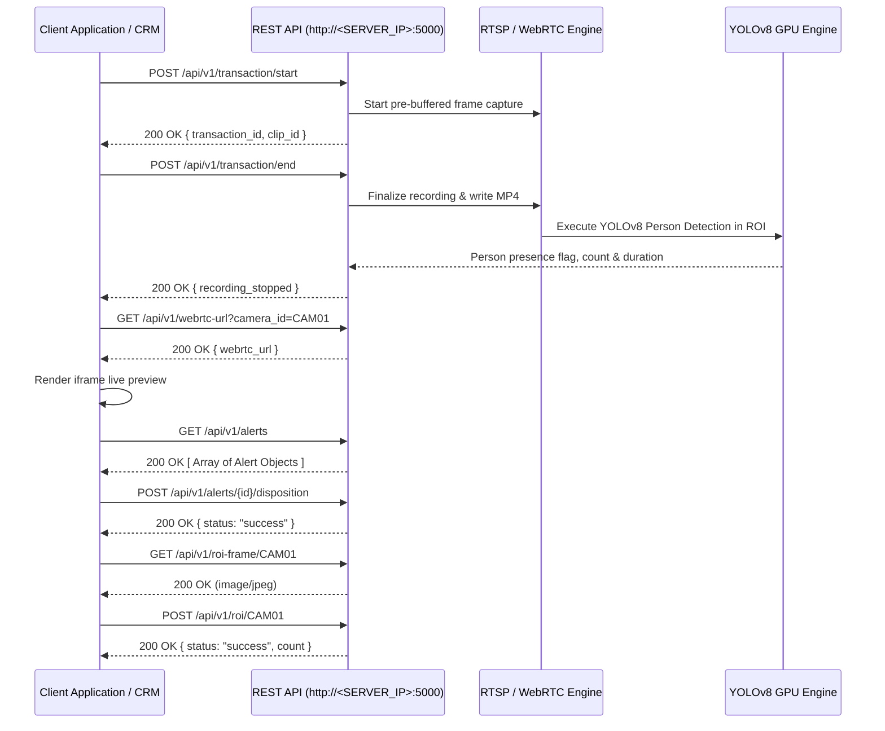

# SmartCare RBATPM — Technical API Integration Specification

### Server Configuration
* **Base URL Pattern:** `http://<SERVER_IP>:5000`
* **Default Port:** `5000`
* **Protocols:** HTTP REST / WebRTC / MJPEG
* **Content-Type:** `application/json` (unless specifying static binary media)

---

## 1. Master API Endpoints Reference

| Index | Category | Method | Endpoint Path | Content-Type | Description |
| :--- | :--- | :--- | :--- | :--- | :--- |
| 1 | Transaction | `POST` | `/api/v1/transaction/start` | `application/json` | Initiate transaction & start pre-buffer recording |
| 2 | Transaction | `POST` | `/api/v1/transaction/end` | `application/json` | Finalize transaction, stop recording & trigger YOLO AI |
| 3 | Transaction | `POST` | `/api/v1/transaction` | `application/json` | *(Legacy)* Auto-ending 3s transaction trigger |
| 4 | Streaming | `GET` | `/api/v1/webrtc-url` | Query Param | Low-latency WebRTC live stream URL |
| 5 | Streaming | `GET` | `/api/v1/live-stream` | Query Param | MJPEG video stream feed (`multipart/x-mixed-replace`) |
| 6 | Streaming | `GET` | `/api/v1/latest-frame.jpg` | Query Param | Single JPEG snapshot capture (`image/jpeg`) |
| 7 | Alerts | `GET` | `/api/v1/alerts` | N/A | Query all alerts, transaction logs, & AI presence flags |
| 8 | Media | `GET` | `/clips/{clip_id}.mp4` | Static File | MP4 video clip playback file (`video/mp4`) |
| 9 | Alerts | `POST` | `/api/v1/alerts/{alert_id}/disposition` | `application/json` | Save auditor remarks, outcome verdict, and close case |
| 10 | ROI Config | `GET` | `/api/v1/roi-frame/{camera_id}` | Path Param | Clean snapshot frame (`image/jpeg`) for ROI canvas background |
| 11 | ROI Config | `GET` | `/api/v1/roi/{camera_id}` | Path Param | Retrieve active ROI polygon coordinates for camera |
| 12 | ROI Config | `POST` | `/api/v1/roi/{camera_id}` | `application/json` | Save / overwrite camera ROI polygon coordinates |
| 13 | ROI Config | `DELETE`| `/api/v1/roi/{camera_id}/{roi_name}`| Path Param | Delete specific ROI polygon zone by name |
| 14 | Counters | `GET` | `/api/v1/counters` | N/A | List counters, mapped cameras, and health status |
| 15 | Counters | `POST` | `/api/v1/counters/{counter_id}/subscription`| `application/json`| Toggle active video recording subscription for counter |
| 16 | System | `GET` | `/` | N/A | HTML Dashboard interface (`text/html`) |
| 17 | System | `POST` | `/upload-images` | `multipart/form-data` | *(Legacy)* Synchronous single image YOLO inference |

---

## 2. API Endpoint Specifications

### 2.1 Transaction Management APIs

#### `POST /api/v1/transaction/start`
* **Description:** Initiates a counter transaction and commands the recording engine to start buffering frames.
* **Headers:** `Content-Type: application/json`
* **Request Schema:**
  ```json
  {
    "staff_id": "string",
    "counter_id": "string",
    "module": "string",
    "action_type": "string",
    "subscription": "Y" | "N",
    "pre_buffer_sec": int,
    "post_buffer_sec": int
  }
  ```
* **Request Payload Example:**
  ```json
  {
    "staff_id": "STF102",
    "counter_id": "Billing Desk 1",
    "module": "Billing",
    "action_type": "Refund",
    "subscription": "Y",
    "pre_buffer_sec": 5,
    "post_buffer_sec": 5
  }
  ```
* **Response Schema (HTTP 200):**
  ```json
  {
    "status": "recording_started" | "logged_only" | "monitoring_gap",
    "transaction_id": "string",
    "clip_id": "string"
  }
  ```

#### `POST /api/v1/transaction/end`
* **Description:** Concludes transaction recording, updates transaction amount, captures post-buffer frames, transcodes video to H.264 MP4, and executes YOLOv8 GPU person detection within configured ROI boundaries.
* **Headers:** `Content-Type: application/json`
* **Request Schema:**
  ```json
  {
    "transaction_id": "string",
    "amount": float
  }
  ```
* **Request Payload Example:**
  ```json
  {
    "transaction_id": "TXN_8F3A12B4",
    "amount": 6500.0
  }
  ```
* **Response Schema (HTTP 200):**
  ```json
  {
    "status": "recording_stopped",
    "transaction_id": "string"
  }
  ```

---

### 2.2 Streaming & Live Video APIs

#### `GET /api/v1/webrtc-url`
* **Query Parameter:** `camera_id` (e.g. `CAM01`)
* **Response Schema (HTTP 200):**
  ```json
  {
    "webrtc_url": "string",
    "camera_id": "string",
    "stream_name": "string"
  }
  ```
* **Response Example:**
  ```json
  {
    "webrtc_url": "http://100.94.110.18:8889/cam1_stream/",
    "camera_id": "CAM01",
    "stream_name": "cam1_stream"
  }
  ```

#### `GET /api/v1/live-stream`
* **Query Parameter:** `camera_id` (e.g. `CAM01`)
* **Response Header:** `Content-Type: multipart/x-mixed-replace; boundary=frame`
* **HTML Implementation:**
  ```html
  :5000/api/v1/live-stream?camera_id=CAM01" alt="Live Stream" />
  ```

#### `GET /api/v1/latest-frame.jpg`
* **Query Parameter:** `camera_id` (e.g. `CAM01`)
* **Response Header:** `Content-Type: image/jpeg`

---

### 2.3 Alerts, CCTV Video Playback & Disposition APIs

#### `GET /api/v1/alerts`
* **Response Schema (HTTP 200):** Array of Alert objects.
* **Response Example:**
  ```json
  [
    {
      "id": 12,
      "transaction_id": "TXN_8F3A12B4",
      "staff_id": "STF102",
      "counter_id": "Billing Desk 1",
      "module": "Billing",
      "action_type": "Refund",
      "amount": 6500.0,
      "timestamp": "2026-08-14T15:30:00",
      "risk_score": "High" | "Medium" | "Low",
      "clip_id": "clip_8f3a12b4c901",
      "clip_url": "/clips/clip_8f3a12b4c901.mp4",
      "recording_status": "Ready" | "Recording" | "Failed",
      "camera_health": "Online" | "Offline",
      "person_present": 0 | 1,
      "person_count": int,
      "presence_duration_sec": float,
      "clip_duration_sec": float,
      "flag": "alert" | "clean" | "monitoring_gap",
      "reviewer_status": "Pending" | "Verified-Clean" | "Verified-Discrepancy" | "Escalated" | "Closed",
      "reviewer_remarks": "string" | null,
      "reviewer_time": "ISO-8601 string" | null,
      "audit_logs": "JSON serialized string array"
    }
  ]
  ```

#### `GET /clips/{clip_id}.mp4`
* **Description:** Serves the transcoded H.264 baseline MP4 video clip for HTML5 video playback.
* **HTML Implementation:**
  ```html
  <video controls autoplay width="100%">
    <source src="http://<SERVER_IP>:5000/clips/clip_8f3a12b4c901.mp4" type="video/mp4">
  </video>
  ```

#### `POST /api/v1/alerts/{alert_id}/disposition`
* **Path Parameter:** `alert_id` (integer)
* **Headers:** `Content-Type: application/json`
* **Request Schema:**
  ```json
  {
    "remarks": "string",
    "outcome": "Verified-Clean" | "Verified-Discrepancy" | "Escalated" | "Closed" | "Dismissed"
  }
  ```
* **Request Payload Example:**
  ```json
  {
    "remarks": "Verified CCTV. Staff member was absent during cash refund transaction.",
    "outcome": "Verified-Discrepancy"
  }
  ```
* **Response Schema (HTTP 200):**
  ```json
  {
    "status": "success"
  }
  ```

---

### 2.4 Region of Interest (ROI) Configuration APIs

#### `GET /api/v1/roi-frame/{camera_id}`
* **Path Parameter:** `camera_id` (e.g. `CAM01`)
* **Response Header:** `Content-Type: image/jpeg` (Clean snapshot frame without text overlays for canvas background).

#### `GET /api/v1/roi/{camera_id}`
* **Path Parameter:** `camera_id` (e.g. `CAM01`)
* **Response Schema (HTTP 200):**
  ```json
  {
    "camera_id": "string",
    "config_width": int,
    "config_height": int,
    "rois": [
      {
        "name": "string",
        "coords": [x1, y1, x2, y2, x3, y3, ...]
      }
    ]
  }
  ```

#### `POST /api/v1/roi/{camera_id}`
* **Path Parameter:** `camera_id` (e.g. `CAM01`)
* **Headers:** `Content-Type: application/json`
* **Request Schema:**
  ```json
  {
    "rois": [
      {
        "name": "string",
        "coords": [int]
      }
    ],
    "config_width": int,
    "config_height": int
  }
  ```
* **Request Payload Example:**
  ```json
  {
    "rois": [
      {
        "name": "Billing Desk Zone 1",
        "coords": [150, 200, 500, 200, 500, 600, 150, 600]
      }
    ],
    "config_width": 1280,
    "config_height": 720
  }
  ```
* **Response Schema (HTTP 200):**
  ```json
  {
    "status": "success",
    "count": int
  }
  ```

#### `DELETE /api/v1/roi/{camera_id}/{roi_name}`
* **Path Parameters:** `camera_id` (string), `roi_name` (string)
* **Response Schema (HTTP 200):** `{"status": "success"}`

---

### 2.5 Counter Management & Subscriptions

#### `GET /api/v1/counters`
* **Response Schema (HTTP 200):**
  ```json
  [
    {
      "counter_id": "string",
      "camera_id": "string",
      "health": "Online" | "Offline",
      "subscription": 0 | 1
    }
  ]
  ```

#### `POST /api/v1/counters/{counter_id}/subscription`
* **Path Parameter:** `counter_id` (string)
* **Headers:** `Content-Type: application/json`
* **Request Payload:**
  ```json
  {
    "active": true
  }
  ```
* **Response Schema (HTTP 200):** `{"status": "success"}`

---

## 3. Sequence Architecture Diagram


