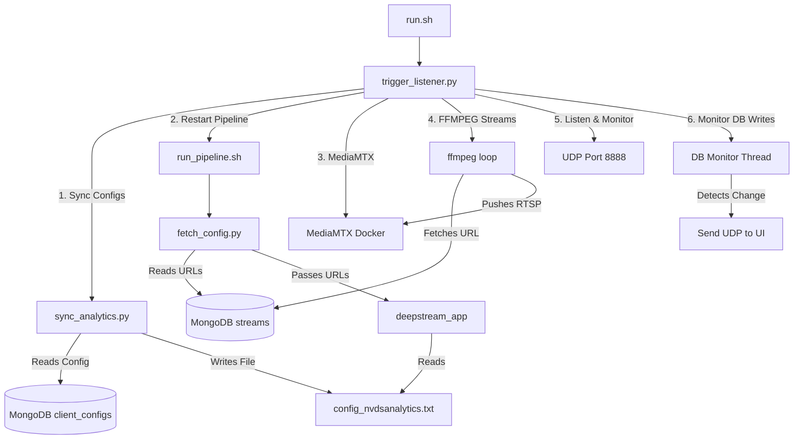

# Pipeline Orchestration & Flow Reference

This document outlines the architecture, logic, and flow of the orchestration scripts that manage the DeepStream AI pipeline, MediaMTX, and MongoDB database syncing. It is designed as a reference for implementing a similar architecture in other projects.

## Overview

The orchestration layer acts as the glue between the backend configurations (stored in MongoDB), the video streams (RTSP routing via MediaMTX and ffmpeg), and the AI inference engine (DeepStream C++ app). 

Key functionalities include:
1. Validating system prerequisites.
2. Generating configuration files dynamically from MongoDB.
3. Managing application lifecycles by spawning components in separate `gnome-terminal` instances.
4. Monitoring MongoDB for changes to automatically signal the frontend/UI.
5. Providing a UDP listener to trigger a full system restart when configuration changes are made from the frontend.

## Architecture & Data Flow

1. **Initialization (`run.sh`)**: The entry point. Validates MongoDB and Docker dependencies, reads `config.ini`, and launches the main orchestrator (`trigger_listener.py`).
2. **Orchestration (`trigger_listener.py`)**: Central command hub. It runs a startup sequence and then loops, listening for UDP triggers to restart components.
3. **Database Syncing (`sync_analytics.py` & `fetch_config.py`)**: Pulls user-defined settings (streams, ROI configs) from MongoDB and writes them to local text/config files for the C++ application to read.
4. **Media Routing (MediaMTX & ffmpeg)**: Spawns MediaMTX inside Docker and routes streams to it via `ffmpeg`.
5. **AI Inference (`run_pipeline.sh` -> `deepstream_app`)**: Rebuilds the C++ code if necessary, grabs the input RTSP URLs, and starts inference.

## File Breakdown

### 1. `run.sh`
* **Purpose**: System validation and bootstrap.
* **Logic**:
  * Checks if `config.ini` exists.
  * Verifies that the `mongod` and `docker` services are active.
  * Uses a Python one-liner to parse `config.ini` and locate the `trigger_listener.py` script.
  * Executes the listener.

### 2. `config.ini`
* **Purpose**: Centralized path and environment variable storage.
* **Logic**: Holds MongoDB credentials, network ports (UDP 8888), file paths, and AI hyperparameters. This prevents hardcoding across the python and bash scripts.

### 3. `scripts/trigger_listener.py`
* **Purpose**: The core orchestrator. Manages processes and listens for UI events.
* **Logic**:
  * **Process Management**: Uses `subprocess.run(["pkill", "-f", ...])` to forcefully terminate existing instances of pipelines, web servers, ffmpeg streams, and the MediaMTX docker container.
  * **Terminal Spawning**: Uses `subprocess.Popen` with `gnome-terminal -- bash -c "..."` to spawn visible, background terminal windows for the HTTP server, MediaMTX docker, FFMPEG streams, and the DeepStream C++ app.
  * **DB Monitoring**: Runs a daemonized thread (`db_monitor_thread()`) that queries MongoDB's `serverStatus` every second. If `opcounters` (inserts/updates/deletes) increase, it sends a UDP `REFRESH_UI` packet to the frontend UI so it knows to reload.
  * **UDP Listener**: Listens on UDP port 8888. If it receives a "RESTART" command, it re-runs the entire initialization sequence (kills everything, syncs DB, respawns terminals).

### 4. `scripts/sync_analytics.py`
* **Purpose**: Translates MongoDB configuration documents into a DeepStream-compatible text file.
* **Logic**: Connects to the `client_configs` collection. It parses either a `raw_text` field or a dictionary and constructs the `config_nvdsanalytics.txt` file, ensuring sections like `[roi-filtering-stream-0]` are properly formatted.

### 5. `AI_Pipeline/deepstream/run_pipeline.sh`
* **Purpose**: Compiles and runs the AI application.
* **Logic**: Calls `fetch_config.py` to retrieve the RTSP URLs. Runs `make` to compile the C++ `deepstream_app`. Executes `./deepstream_app $URLS` with the retrieved URLs.

### 6. `AI_Pipeline/deepstream/fetch_config.py`
* **Purpose**: Retrieves camera URLs.
* **Logic**: Connects to the `streams` collection in MongoDB, sorts by `order_index`, and prints space-separated RTSP URLs so `run_pipeline.sh` can pass them as arguments to the C++ binary.

## How to Implement this in a New Project

To replicate this logic in a new AI/Computer Vision project:

1. **Centralize Configuration**: Create a `config.ini` or `.env` file that all scripts reference. Avoid hardcoding DB URIs and script paths.
2. **Use a "God" Script (Orchestrator)**: Build a Python script like `trigger_listener.py` that handles the startup and teardown of all micro-services.
3. **Database as the Source of Truth**: 
   * When the UI needs to update a configuration (like an ROI zone or a stream URL), it writes to the Database, not a local file.
   * The Orchestrator or a Sync script (`sync_analytics.py`) reads the Database and generates the necessary local text files needed by the C++ engine.
4. **Isolate Processes in Terminals**: For debugging, spawn distinct components (AI engine, Stream proxy, Web Server) in their own `gnome-terminal` or `tmux` sessions. Use `pkill -f` to ensure clean restarts.
5. **Event-Driven Restarts**: Use a lightweight protocol like UDP to signal the Orchestrator to restart the pipeline when configuration changes occur, rather than relying on complex API servers or web sockets within the orchestrator itself.
6. **Real-time UI Sync**: Implement a background thread in the Orchestrator that polls MongoDB's `opcounters`. When a write occurs, fire a UDP ping to the frontend so it can refetch the latest data, keeping the UI perfectly in sync with the database state.
